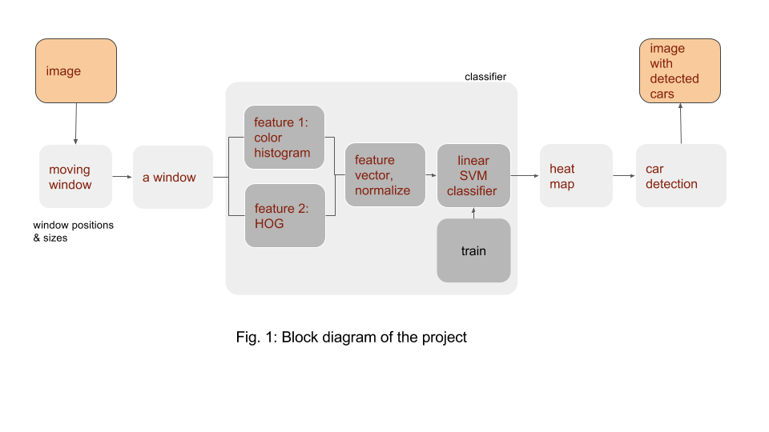
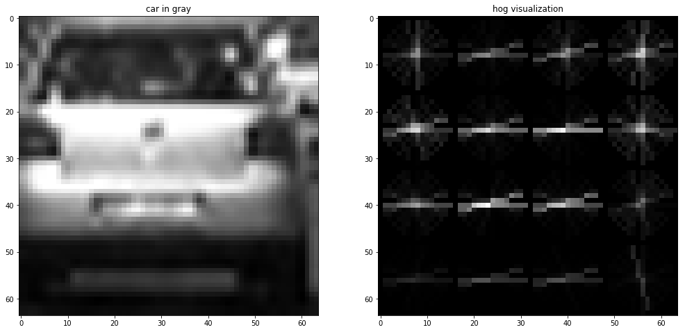
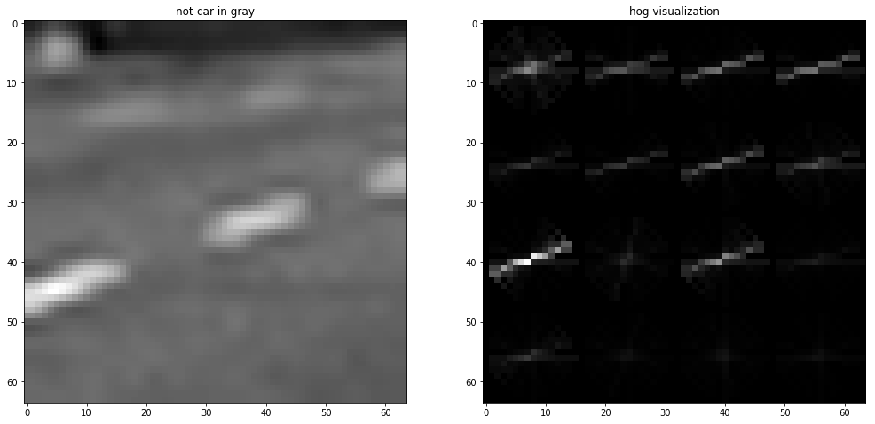
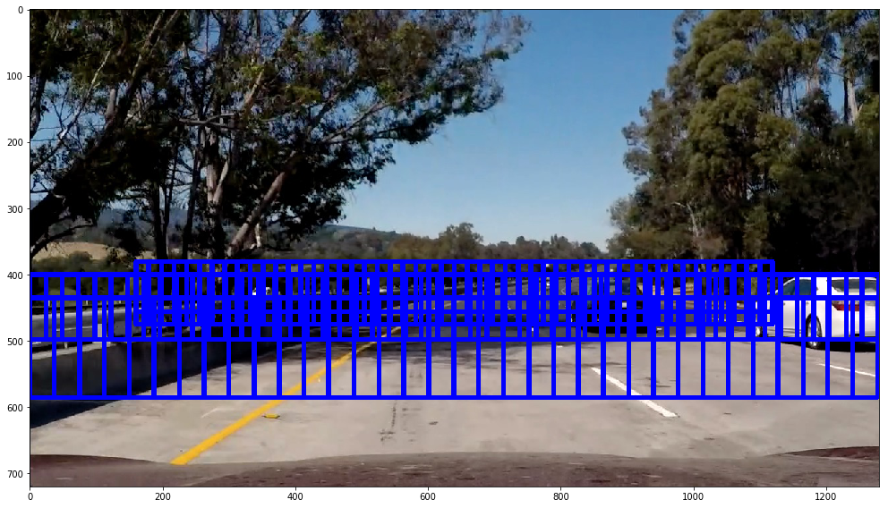
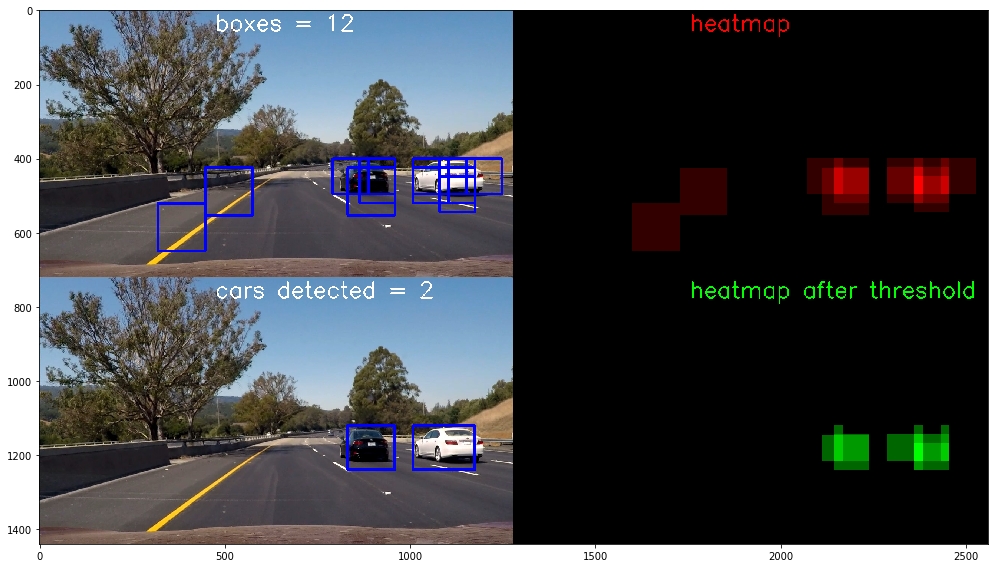

##Project 5: Vehicle Detection
---

**Vehicle Detection Project**

Here is a high level block diagram of the project:

The goals / steps of this project are the following:

* Classifier:  the classifier includes feature extraction followed by a classifier on $64 \times 64$ images

  * a HOG feature extraction on a labeled training set of images
  * histograms of color, added to the HOG feature
  * normalize features and randomize a selection for training and testing
  * train Linear SVM classifier

* Sliding window: generate windows at different positions and with varied scales 
  * each window is fed to the feature-extractor/classifier
  * if window is detected then it increments the heat within the window
* Detection: 
  * generate pipeline for a frame
  * each detected window increments a heat map which is accumulated over multiple frames 
  * Run video stream, threshold accumulated heat map
  * Estimate a bounding box for vehicles detected

**Jupyter Notebook**

* Code was developed on Jupyter Notebook platform
* Most functions are defined in **cell-2**
* A class that tracks the heat-map is defined in **cell-3**
* two pipelines, one for debugging and one of final video generation are coded in **cell-4** 
* all hyper-parameters are defined in **cell-5**

## [Rubric](https://review.udacity.com/#!/rubrics/513/view) Points
---
###Writeup / README

###Histogram of Oriented Gradients (HOG)

####1. Explain how (and identify where in your code) you extracted HOG features from the training images. Explain how you settled on your final choice of HOG parameters.

* The function (in **cell-2**) **get_hog_feature()**, extracts the hog feature of a single channel. 

  * the code is similar to the one used in lecture notes

* The function (in **cell-2**) **get_hog_features()**, extracts the hog feature of all three color components 

* Here is an example of one of each of the vehicle and non-vehicle classes (see **cell-6**):

  

  

#####  Small feature space dimensionality:

- One of my goals was to simplify computations, possibly make the algorithm more robust, and speed up the detection process

- since the classifier was being trained on $64 \times 64$ images, I wanted a **block** (as defined  in scikit-image function hog()), to have the same size (in pixels) as a $64 \times 64$ window
- to this end, I ended up using  PIX_P_CELL = 8, CELL_P_BLOCK   = 8 so that a block would end up being a square, with $8\times 8=64$ pixels length

- Orientations:

  - I kept HOG_BINS  = 9  

- Csapce:

  - I used all three channels (CHANNELS = -1) and tried RGB, LUV, YCrCb & HLS color spaces

  - YCrCb and LUV did marginally better than others, but YCrCb gave a little better accuracy

  - as a result, I chose 

    CSPACE                = YCrCb

- My final accuracy using these hyper-parameters was **98.85%** 

####2. Describe how (and identify where in your code) you trained a classifier using your selected HOG features (and color features if you used them).

- The classifier is trained in **cell-7**, and includes the following 5 steps:

  1. Get data from directories

     - The function get_x__y() reads all images from a given directory_
     - _The function get_X_Y() reads from a list of directories
     - Since the cars and non-cars were balanced at 50%, or roughly 8792 each, I used all the images

  2. Extract features using  **get_F()**

     - in addition to hog I also extracted the color histogram for all 3-color spaces (YCrCb), each in 32 bit resolution, for a total size of $32 \times 3 = 96$ 

     - the hog has dimensionaly of 

       $1 \times 1 \times 8 \times 8 \times 9 = 576$

       where there are $8$ cells per block and $9$ bins per cell. Over $3$ channels hog() generates a feature of size

       $576 \times 3 = 1719$

     - the total size of the feature vector is $1719+64=1815$

     - hence the dimensionality of a window has decreased from $64^2=4096$ to $1815$

    3. Normalize data using StandardScaler() function (as discussed in class)

    4. Shuffled and partitioned data using train_test_split() function as discussed in class

     - I used 25% of data for testing, TEST_FRAC      = 0.25

    5. Train data on classifier

     - used LinearSCV() classifier 
     - Since this classifier was recommended by instructor, I did not spend time looking at others
     - I optimized the $C$ parameter by scanning it from $0.0001$ o $2$ 
       - since the LinearCSV needs only one parameter to optimize, I did not use optimization tools available and just did it by hand
     - C_SVM          = 0.0001 gave me best result

###Sliding Window Search

####1. Describe how (and identify where in your code) you implemented a sliding window search.  How did you decide what scales to search and how much to overlap windows?

- Window positioning and scaling are explored in **cell-9**

- Instead of using a single number for SCALE, I used a vector SCALE and ended up with 3 different components

  - SCALE         = (2.35, 20/13, 1.2)
  - lower portions of the image were associated with larger scales, whereas higher portions were associated with smaller scales
  - the hog feature is computed once per scale, so with 3 scales hog is applied 3 times

- Furthermore, for each scale value I associated its own 

  - Y-range (Y_LIM),   start/end
  - X-range (X_LIM) start/end
  - X-interval (INT_X)  jumps in cells along x-axis 
  - Y-interval (INT_Y) jumps in cells along y-axis

- Here are the numbers I ended up using

  Y_LIM         = ((435,610),(400, 520),(380, 480))
  X_LIM         = ((0,1280),(0, 1280),(160, 1280-160))
  INT_X          = (2,2,2)

  INT_Y         = (2,2,2)

- For X_LIM I took the whole range for lower windows (bottom) but, due to perspective, I could limit the x-range on higher windows (top) 

- This configuration gave me a total of $174$ images per frame, here is the set of windows

  

####2. Show some examples of test images to demonstrate how your pipeline is working.  What did you do to optimize the performance of your classifier?

For each frame, the pipeline (**cell-4**) goes through the following steps:

- get hot boxes: extract 174 windows from a frame and feed them to the classifier (feature extraction + normalization + LinearSVM), using function find_boxes()
  - this function returns the boxes associated with positive detection
- Heat-map
  - positive boxes are used to generate a heatmap as was discussed in class
  - added a new class **state** (**cell-3**), that keeps track of heat-maps over multiple consecutive frames
    -  the number of frames tracked is set by the hyper-parameter  FRAMES 
    -  Large FRAMES averages noise, at the expense of latency
    -  I ended up using FRAMES=16 which is  ~1/2 second
- I apply a threshold (HEAT_THR) on this accumulated heatmap
  - putting threshold too low will pass through many wrong positives, while putting it too high will not detect car
  - I ended up using HEAT_THR = 27
- The **label()**  function was used from  scipy.ndimage.measurements, as discussed in class, to convert the thresholded heat-map to detecting cars 
- The image below shows the steps visually for a single frame (used FRAMES=1, HEAT_THR=1) since its not a movie
  - in this example, 12 boxes were detected with a single false positive 
  - in this example the thresholded heatmap eliminates the 2 false positives
  - Finally, the lower/left picture shows the 2 detected cars

### Video Implementation

####1. Provide a link to your final video output.  Your pipeline should perform reasonably well on the entire project video (somewhat wobbly or unstable bounding boxes are ok as long as you are identifying the vehicles most of the time with minimal false positives.)

The 2 video files are

- **P5_video_debug.mp4**  which includes intermediate states
- **P5_video.mp4** the final video clip

####2. Describe how (and identify where in your code) you implemented some kind of filter for false positives and some method for combining overlapping bounding boxes.

- I discussed this under sliding window search part (2). 
- The debug pipeline was written specifically for this task
  - see video clip **P5_video_debug.mp4**  

---

###Discussion

####1. Briefly discuss any problems / issues you faced in your implementation of this project.  Where will your pipeline likely fail?  What could you do to make it more robust?

- My major struggle was false positives mostly at freeway boundaries, including yellow lanes
- I also struggled with a false negative on the white car around 25-28 second time-frame
- I mostly addressed these issues by 
  - increasing the classifier accuracy from 97.75 to 98.85 , by
    - decreasing pixels per cell size from $16$ to $8$
    - decreased the $C$ parameter from $0.5$ to $0.001$ 
  - I also increased the overlap, or decreased the the distance between adjacent windows from $32$ or $48$ pixels (depending on scale) to $16$ 
- I am processing about ~5 frames per second which is still significantly short of real time processing
  - despite simplification efforts not processing data real-time

